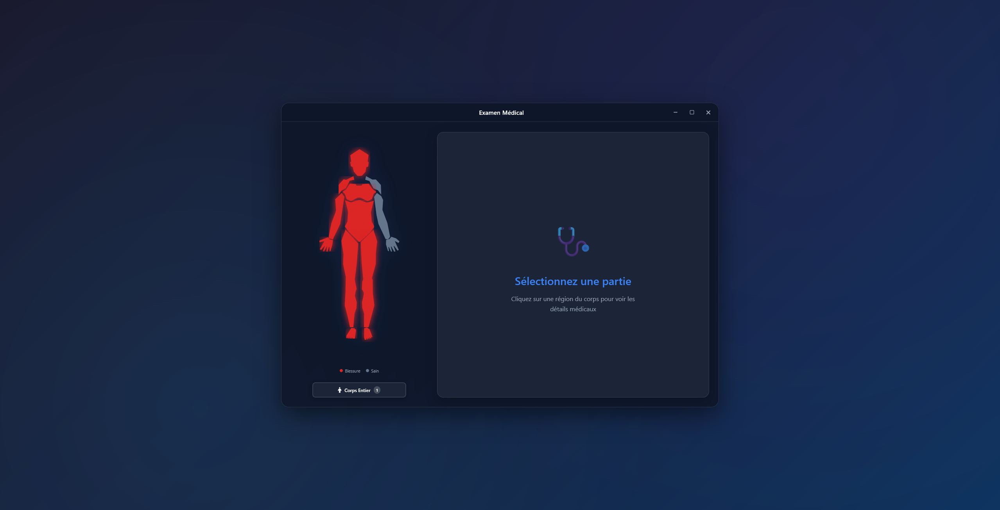
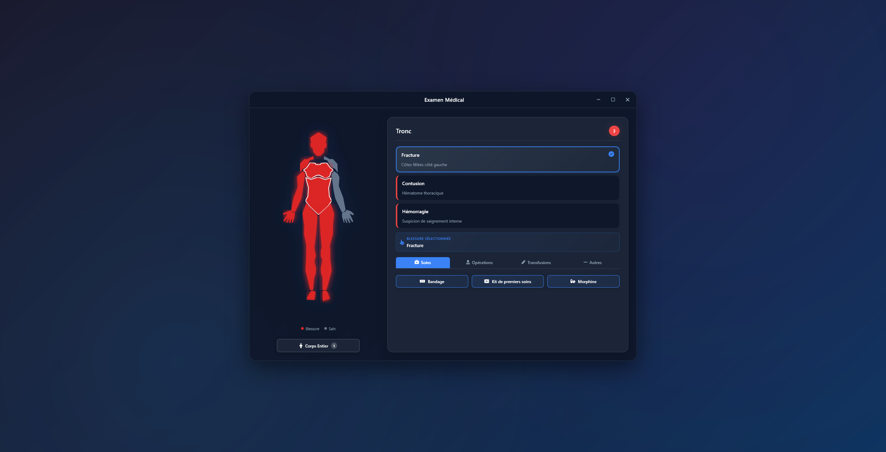

# Medical UI – Interface EMS pour FiveM

Interface médicale moderne développée pour les services EMS de San Andreas.  
Permet l’inspection du corps humain, la visualisation des blessures et l’application d’actions médicales via une interface NUI ergonomique et réactive.

---

## Aperçu visuel

<!-- Ajouter ici un aperçu général de l'interface (interface complète ouverte dans le jeu) -->



<!-- Ajouter ici un second screen montrant le panel des blessures -->



---

## Fonctionnalités principales

- Interface NUI réactive (React + TailwindCSS)
- Visualisation détaillée du corps humain (composant SVG dynamique)
- Panneau d’inspection des blessures par partie du corps
- Système d’actions médicales (bandage, suture, morphine, etc.)
- Design adaptable (effet verre dépoli, couleurs configurables)
- Mode démonstration indépendant pour tests hors serveur

---

## Structure du projet

```

EMS_UI/
├── client/                # Scripts client Lua (interactions, messages NUI)
├── server/                # Scripts serveur Lua (synchronisation, traitements)
├── shared/                # Fichiers partagés (constantes, types, etc.)
├── ui/                    # Interface utilisateur (React + Vite + Tailwind)
│   ├── src/               # Code source React
│   ├── dist/              # Build final généré pour le NUI
│   ├── tailwind.config.js # Configuration du thème Tailwind
│   ├── postcss.config.cjs # Configuration PostCSS
│   ├── vite.config.js     # Configuration Vite
│   └── package.json       # Dépendances et scripts UI
├── fxmanifest.lua         # Déclaration principale du script FiveM
└── README.md              # Documentation du projet

```

---

## Installation

1. Cloner le dépôt dans le dossier `resources` de ton serveur FiveM :

```bash
cd resources
git clone https://github.com/<ton-utilisateur>/EMS_UI.git ems-ui
```

2. Se placer dans le dossier `ui` et installer les dépendances :

```bash
cd ems-ui/ui
npm install
```

3. Construire le build de production :

```bash
npm run build
```

4. Vérifier que le dossier `ui/dist` contient les fichiers générés :

```
ui/dist/index.html
ui/dist/assets/*
```

5. Ajouter la ressource dans `server.cfg` :

```
ensure ems-ui
```

---

## Configuration

Les paramètres visuels sont définis dans `ui/src/config/config.js`.

Exemples de configuration personnalisable :

- Couleurs principales du thème (`primary`, `accent`, `bgPrimary`, etc.)
- Mode démonstration (`showcase: true` pour tester sans backend)
- Catégories et icônes d’actions médicales

---

## Développement (Mode UI uniquement)

Pour lancer le projet en mode développement :

```bash
cd ui
npm run dev
```

Accès local : [http://localhost:5173](http://localhost:5173)

---

## Intégration FiveM

- Le `fxmanifest.lua` charge automatiquement la page `ui/dist/index.html` comme interface NUI.
- Les actions (postes de soin, traitements) peuvent être reliées à des événements client via :

```lua
SendNUIMessage({ type = "openMedicalUI", data = {...} })
```

- Fermeture de l’UI :

```lua
SendNUIMessage({ type = "closeMedicalUI" })
SetNuiFocus(false, false)
```

---

## Crédits

Développement : **NRW**
Framework : **React + Vite + TailwindCSS**
Intégration : **FiveM (Lua + NUI)**
Projet destiné exclusivement à **Sun Andreas RP**

---

## Licence

Projet destiné à un usage interne RP.
Toute réutilisation ou distribution non autorisée est interdite sans accord explicite.
